## Resumen histórico

<h3 style="margin-top:0;">Libros</h3>

Total páginas leídas

195883

Número de libros

664

<h3 style="margin-top:0;">Cómics/Manga</h3>

Total páginas leídas

47596

Número de cómics/manga

231

<h3 style="margin-top:0;">Libros: más corto y más largo</h3>

  
  

    
Más corto

    
9

    
páginas

  

  
  

    
Más largo

    
1152

    
páginas

  

<h3 style="margin-top:0;">Cómics/Manga: más corto y más largo</h3>

  
  

    
Más corto

    
22

    
páginas

  

  
  

    
Más largo

    
1376

    
páginas

  

<h3 style="margin-top:0;">Longitud media</h3>

Libros

295

páginas de media

Cómics/Manga

206

páginas de media

<h3 style="margin-top:0;">Top 5 géneros</h3>

Libros
<ol style="margin:0;padding-left:1.2rem;"><li>Ficción (500)</li><li>Club de lectura (191)</li><li>Novela (190)</li><li>Fantasía (185)</li><li>Contemporaneo (175)</li></ol>

Cómics/Manga
<ol style="margin:0;padding-left:1.2rem;"><li>Novela gráfica (196)</li><li>Ficción (139)</li><li>Fantasía (79)</li><li>Humor (44)</li><li>Ciencia ficción (40)</li></ol>

<h3 style="margin-top:0;">Autores más leídos</h3>

Libros
<ol style="margin:0;padding-left:1.2rem;"><li>J.K. Rowling (10)</li><li>Michael McDowell (9)</li><li>Grady Hendrix (8)</li><li>P. Djèlí Clark (5)</li><li>Bill Bryson (4)</li></ol>

Cómics/Manga
<ol style="margin:0;padding-left:1.2rem;"><li>Matt Fraction (31)</li><li>Peter Bagge (13)</li><li>Rumiko Takahashi (9)</li><li>N.D. Stevenson (9)</li><li>Yarō Abe (8)</li></ol>

<h3 style="margin-top:0;">Editoriales más leídas</h3>

Libros
<ol style="margin:0;padding-left:1.2rem;"><li>Libros del Asteroide (28)</li><li>Blackie Books (26)</li><li>Editorial Anagrama (25)</li><li>Literatura Random House (18)</li><li>Valdemar (16)</li></ol>

Cómics/Manga
<ol style="margin:0;padding-left:1.2rem;"><li>Image Comics (23)</li><li>Astiberri (19)</li><li>Ediciones Glénat España (12)</li><li>La Cúpula (11)</li><li>Norma Editorial (9)</li></ol>

<h3 style="margin-top:0;">Valoración</h3>
Media de nota (numérica): <strong>3.70</strong>

Nota más frecuente (texto): <strong>Recomendable</strong>

## 2026

<h3 style="margin-top:0;">Libros</h3>

Total páginas leídas

6352

Número de libros

26

<h3 style="margin-top:0;">Cómics/Manga</h3>

Total páginas leídas

13348

Número de cómics/manga

86

<h3 style="margin-top:0;">Lecturas 2026</h3>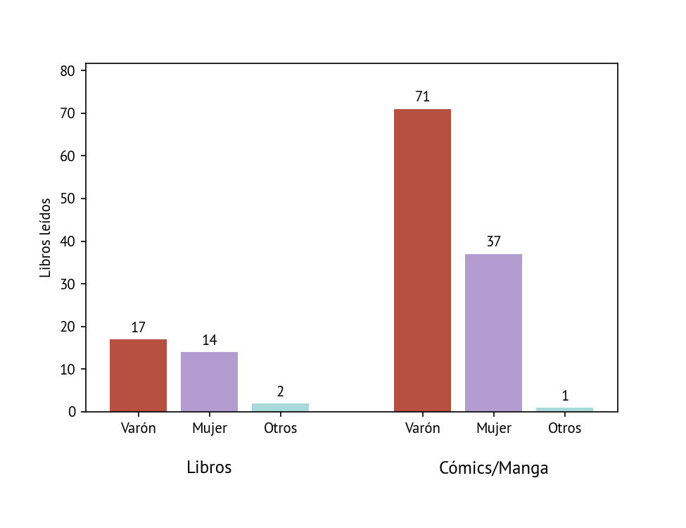

<h3 style="margin-top:0;">Libros: más corto y más largo</h3>

  
  

    
Más corto

    
38

    
páginas

  

  
  

    
Más largo

    
560

    
páginas

  

<h3 style="margin-top:0;">Cómics/Manga: más corto y más largo</h3>

  
  

    
Más corto

    
25

    
páginas

  

  
  

    
Más largo

    
608

    
páginas

  

<h3 style="margin-top:0;">Longitud media</h3>

Libros

244

páginas de media

Cómics/Manga

155

páginas de media

<h3 style="margin-top:0;">Top 5 géneros</h3>

Libros
<ol style="margin:0;padding-left:1.2rem;"><li>Ficción (14)</li><li>Contemporaneo (7)</li><li>Novela (7)</li><li>Clásico (6)</li><li>Ficción Literaria (6)</li></ol>

Cómics/Manga
<ol style="margin:0;padding-left:1.2rem;"><li>Novela gráfica (73)</li><li>Ficción (59)</li><li>Fantasía (33)</li><li>Jovenes adultos (19)</li><li>Humor (16)</li></ol>

<h3 style="margin-top:0;">Valoración</h3>
Media de nota (numérica): <strong>3.50</strong>

Nota más frecuente (texto): <strong>Recomendable</strong>

<h3 style="margin-top:0;">Páginas leídas por mes (Libros) — 2026</h3>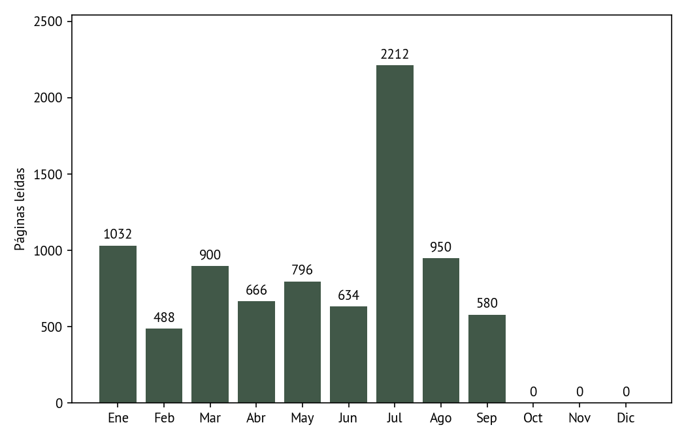

<h3 style="margin-top:0;">Páginas leídas por mes (Cómics/Manga) — 2026</h3>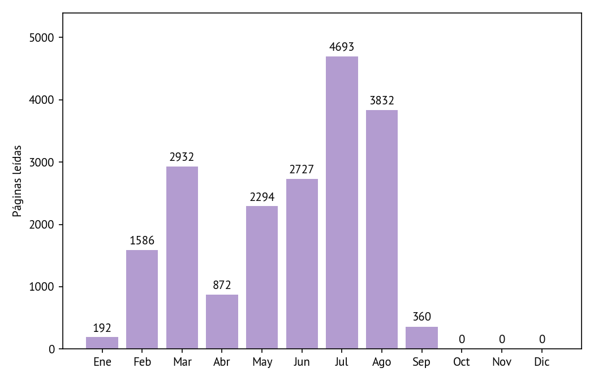

<h3 style="margin-top:0;">Media diaria de páginas leídas, por mes — 2026</h3>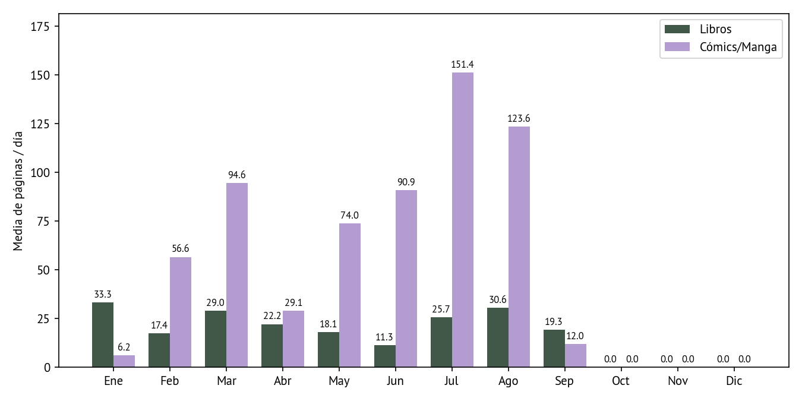

## 2025

<h3 style="margin-top:0;">Libros</h3>

Total páginas leídas

10980

Número de libros

41

<h3 style="margin-top:0;">Cómics/Manga</h3>

Total páginas leídas

15163

Número de cómics/manga

54

<h3 style="margin-top:0;">Lecturas 2025</h3>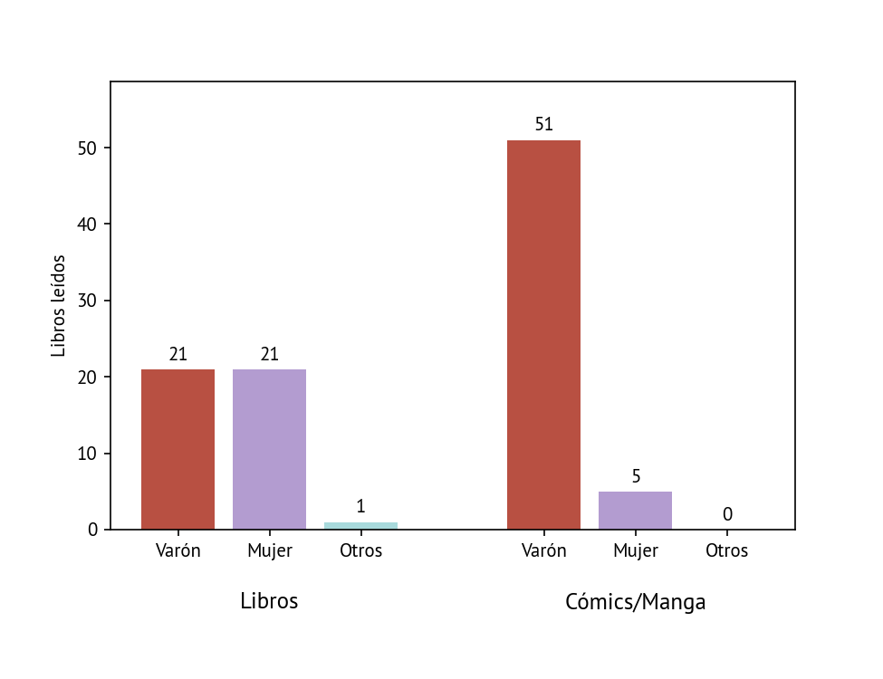

<h3 style="margin-top:0;">Libros: más corto y más largo</h3>

  
  

    
Más corto

    
74

    
páginas

  

  
  

    
Más largo

    
556

    
páginas

  

<h3 style="margin-top:0;">Cómics/Manga: más corto y más largo</h3>

  
  

    
Más corto

    
64

    
páginas

  

  
  

    
Más largo

    
1376

    
páginas

  

<h3 style="margin-top:0;">Longitud media</h3>

Libros

268

páginas de media

Cómics/Manga

281

páginas de media

<h3 style="margin-top:0;">Top 5 géneros</h3>

Libros
<ol style="margin:0;padding-left:1.2rem;"><li>Ficción (29)</li><li>Club de lectura (15)</li><li>Fantasía (12)</li><li>Ficción Literaria (12)</li><li>Terror (11)</li></ol>

Cómics/Manga
<ol style="margin:0;padding-left:1.2rem;"><li>Novela gráfica (45)</li><li>Ficción (31)</li><li>Fantasía (16)</li><li>Ciencia ficción (11)</li><li>Adultos (9)</li></ol>

<h3 style="margin-top:0;">Valoración</h3>
Media de nota (numérica): <strong>3.92</strong>

<h3 style="margin-top:0;">Páginas leídas por mes (Libros) — 2025</h3>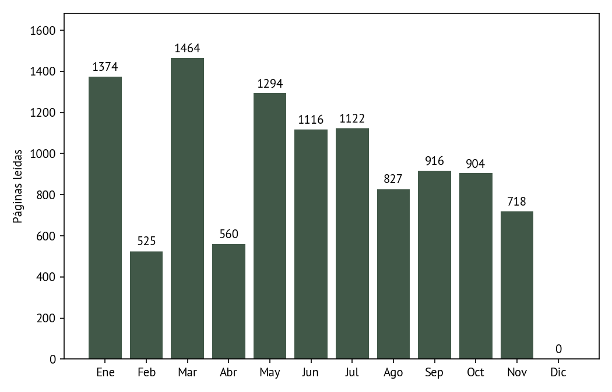

<h3 style="margin-top:0;">Páginas leídas por mes (Cómics/Manga) — 2025</h3>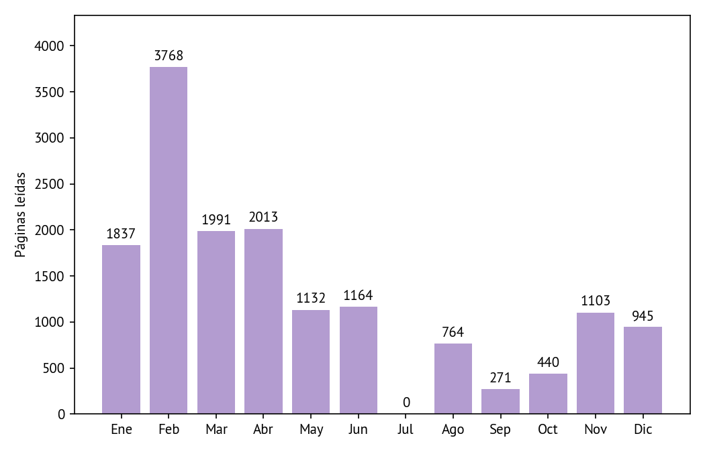

<h3 style="margin-top:0;">Media diaria de páginas leídas, por mes — 2025</h3>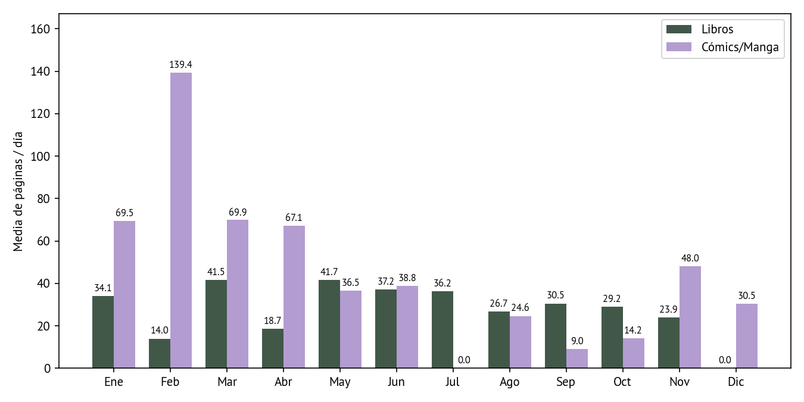

## 2024

<h3 style="margin-top:0;">Libros</h3>

Total páginas leídas

10326

Número de libros

40

<h3 style="margin-top:0;">Cómics/Manga</h3>

Total páginas leídas

11297

Número de cómics/manga

38

<h3 style="margin-top:0;">Lecturas 2024</h3>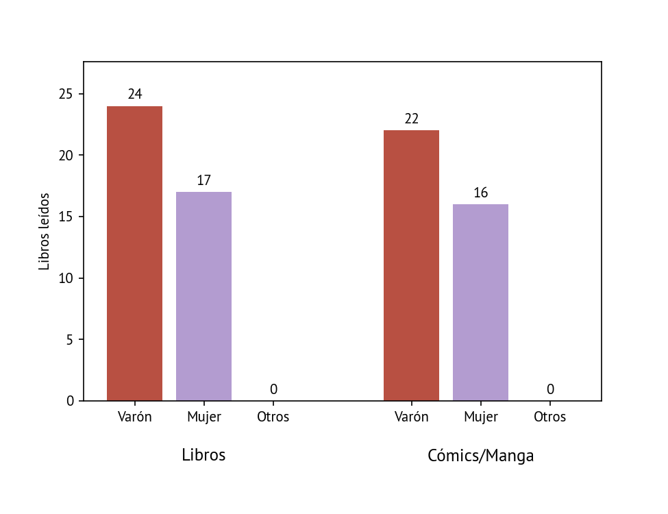

<h3 style="margin-top:0;">Libros: más corto y más largo</h3>

  
  

    
Más corto

    
104

    
páginas

  

  
  

    
Más largo

    
496

    
páginas

  

<h3 style="margin-top:0;">Cómics/Manga: más corto y más largo</h3>

  
  

    
Más corto

    
88

    
páginas

  

  
  

    
Más largo

    
720

    
páginas

  

<h3 style="margin-top:0;">Longitud media</h3>

Libros

258

páginas de media

Cómics/Manga

297

páginas de media

<h3 style="margin-top:0;">Top 5 géneros</h3>

Libros
<ol style="margin:0;padding-left:1.2rem;"><li>Ficción (34)</li><li>Terror (18)</li><li>Fantasía (17)</li><li>Thriller (13)</li><li>Ficción histórica (12)</li></ol>

Cómics/Manga
<ol style="margin:0;padding-left:1.2rem;"><li>Novela gráfica (29)</li><li>Ficción (23)</li><li>Humor (12)</li><li>Literatura japanesa (12)</li><li>Romance (11)</li></ol>

<h3 style="margin-top:0;">Valoración</h3>
Media de nota (numérica): <strong>3.87</strong>

<h3 style="margin-top:0;">Páginas leídas por mes (Libros) — 2024</h3>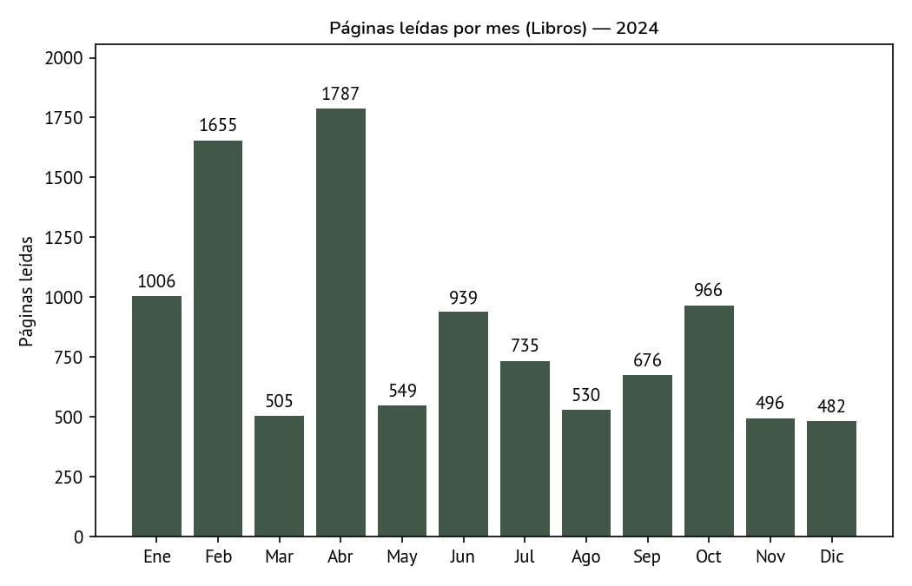

<h3 style="margin-top:0;">Páginas leídas por mes (Cómics/Manga) — 2024</h3>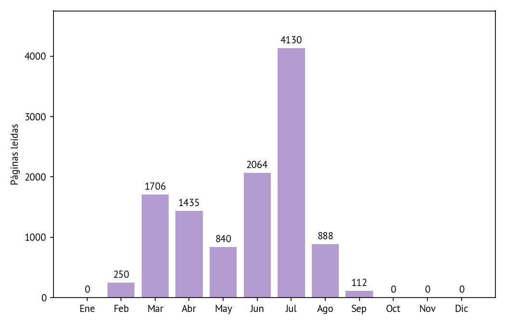

<h3 style="margin-top:0;">Media diaria de páginas leídas, por mes — 2024</h3>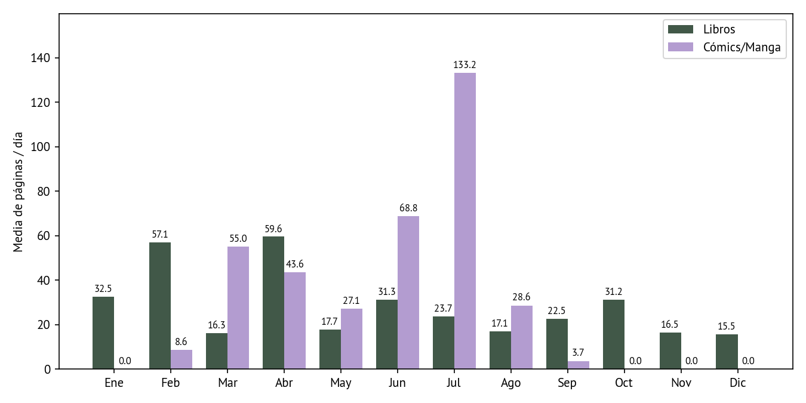

## 2023

<h3 style="margin-top:0;">Libros</h3>

Total páginas leídas

10363

Número de libros

35

<h3 style="margin-top:0;">Cómics/Manga</h3>

Total páginas leídas

600

Número de cómics/manga

4

<h3 style="margin-top:0;">Lecturas 2023</h3>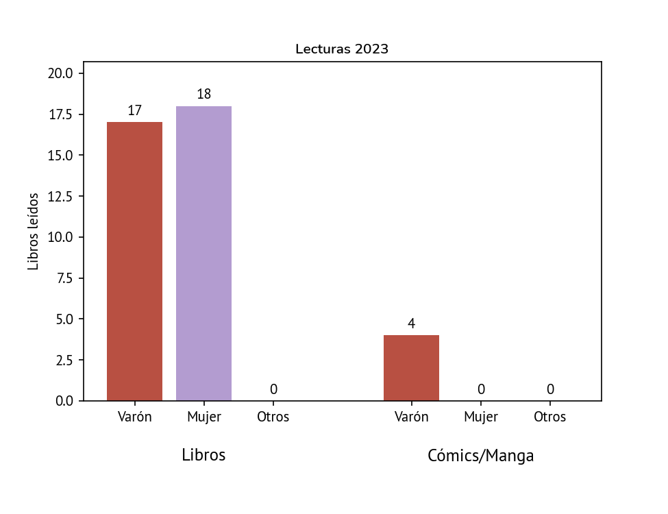

<h3 style="margin-top:0;">Libros: más corto y más largo</h3>

  
  

    
Más corto

    
32

    
páginas

  

  
  

    
Más largo

    
888

    
páginas

  

<h3 style="margin-top:0;">Cómics/Manga: más corto y más largo</h3>

  
  

    
Más corto

    
96

    
páginas

  

  
  

    
Más largo

    
216

    
páginas

  

<h3 style="margin-top:0;">Longitud media</h3>

Libros

296

páginas de media

Cómics/Manga

150

páginas de media

<h3 style="margin-top:0;">Top 5 géneros</h3>

Libros
<ol style="margin:0;padding-left:1.2rem;"><li>Ficción (27)</li><li>Contemporaneo (14)</li><li>Club de lectura (12)</li><li>Relatos (9)</li><li>Fantasía (9)</li></ol>

Cómics/Manga
<ol style="margin:0;padding-left:1.2rem;"><li>Novela gráfica (1)</li><li>Fantasía (1)</li></ol>

<h3 style="margin-top:0;">Valoración</h3>
Media de nota (numérica): <strong>3.87</strong>

<h3 style="margin-top:0;">Páginas leídas por mes (Libros) — 2023</h3>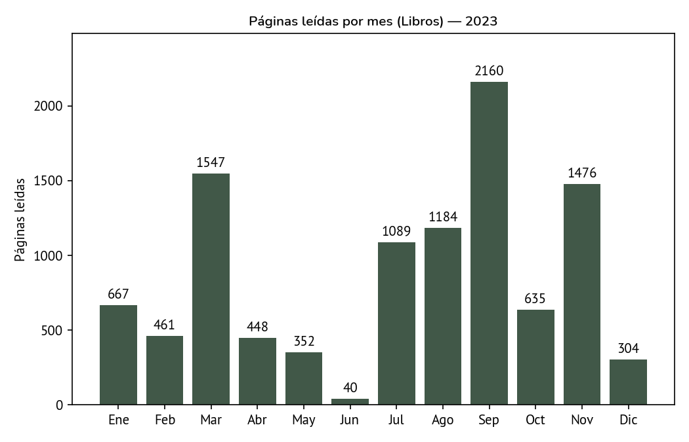

<h3 style="margin-top:0;">Páginas leídas por mes (Cómics/Manga) — 2023</h3>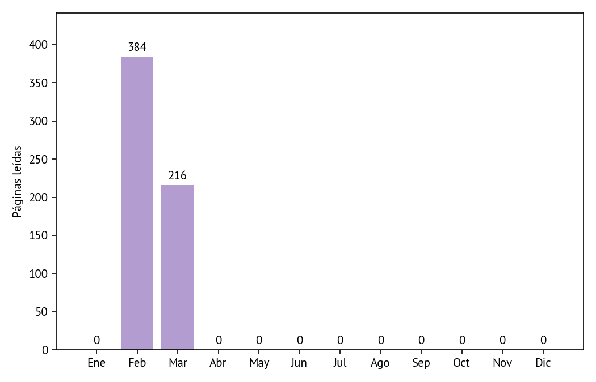

<h3 style="margin-top:0;">Media diaria de páginas leídas, por mes — 2023</h3>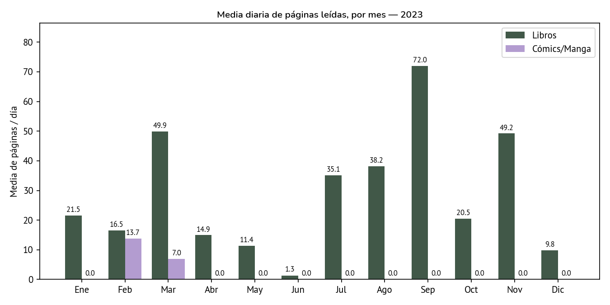

## 2022

<h3 style="margin-top:0;">Libros</h3>

Total páginas leídas

14304

Número de libros

51

<h3 style="margin-top:0;">Cómics/Manga</h3>

Total páginas leídas

2435

Número de cómics/manga

9

<h3 style="margin-top:0;">Lecturas 2022</h3>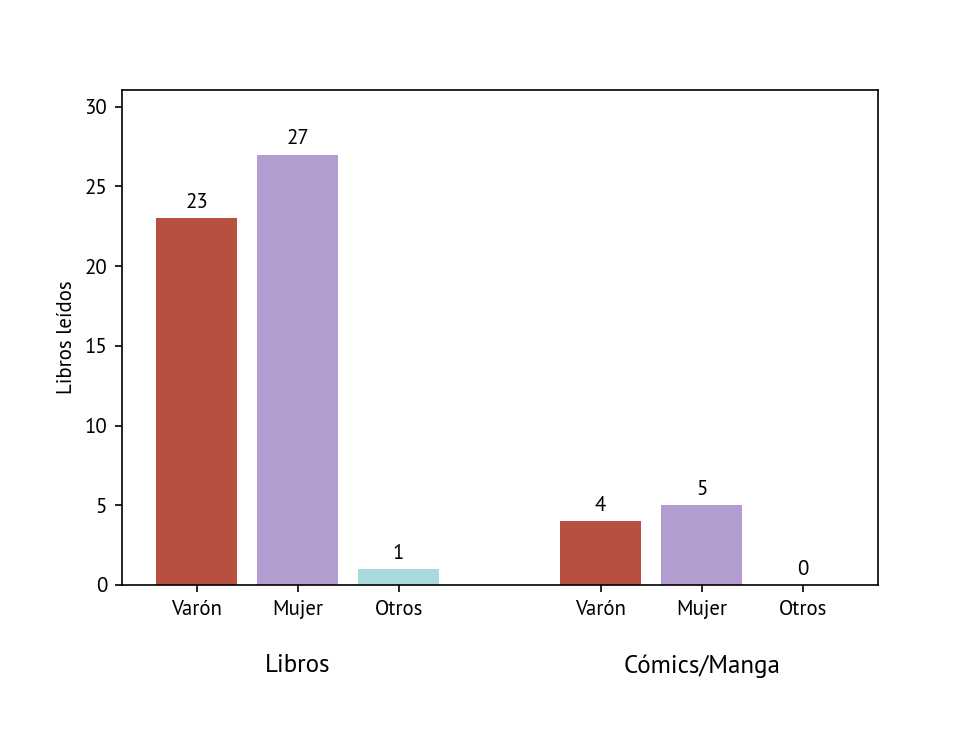

<h3 style="margin-top:0;">Libros: más corto y más largo</h3>

  
  

    
Más corto

    
42

    
páginas

  

  
  

    
Más largo

    
608

    
páginas

  

<h3 style="margin-top:0;">Cómics/Manga: más corto y más largo</h3>

  
  

    
Más corto

    
109

    
páginas

  

  
  

    
Más largo

    
384

    
páginas

  

<h3 style="margin-top:0;">Longitud media</h3>

Libros

280

páginas de media

Cómics/Manga

271

páginas de media

<h3 style="margin-top:0;">Top 5 géneros</h3>

Libros
<ol style="margin:0;padding-left:1.2rem;"><li>Ficción (33)</li><li>Club de lectura (18)</li><li>Novela (12)</li><li>Fantasía (12)</li><li>Contemporaneo (11)</li></ol>

Cómics/Manga
<ol style="margin:0;padding-left:1.2rem;"><li>Novela gráfica (8)</li><li>Jovenes adultos (6)</li><li>Ficción (6)</li><li>Contemporaneo (5)</li><li>Romance (5)</li></ol>

<h3 style="margin-top:0;">Valoración</h3>
Media de nota (numérica): <strong>3.92</strong>

<h3 style="margin-top:0;">Páginas leídas por mes (Libros) — 2022</h3>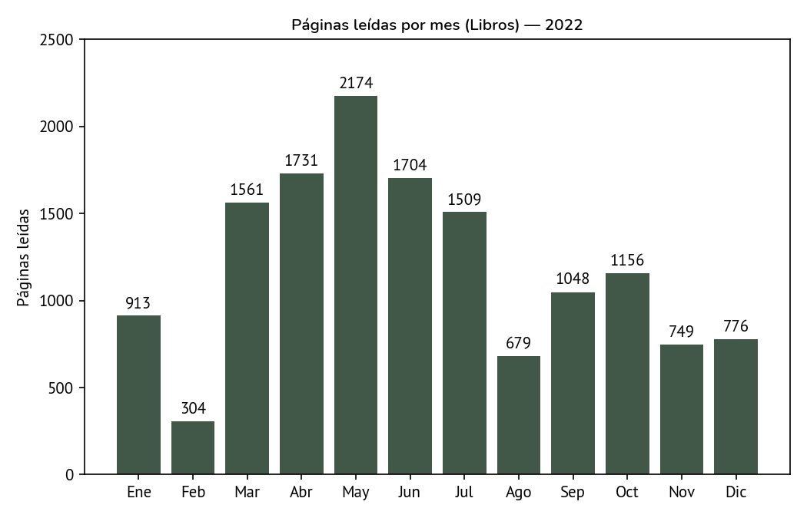

<h3 style="margin-top:0;">Páginas leídas por mes (Cómics/Manga) — 2022</h3>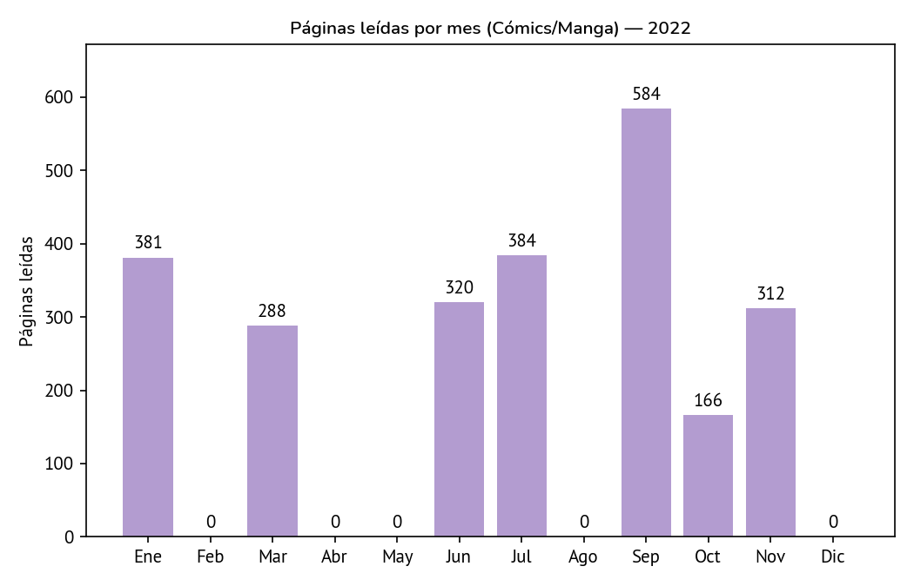

<h3 style="margin-top:0;">Media diaria de páginas leídas, por mes — 2022</h3>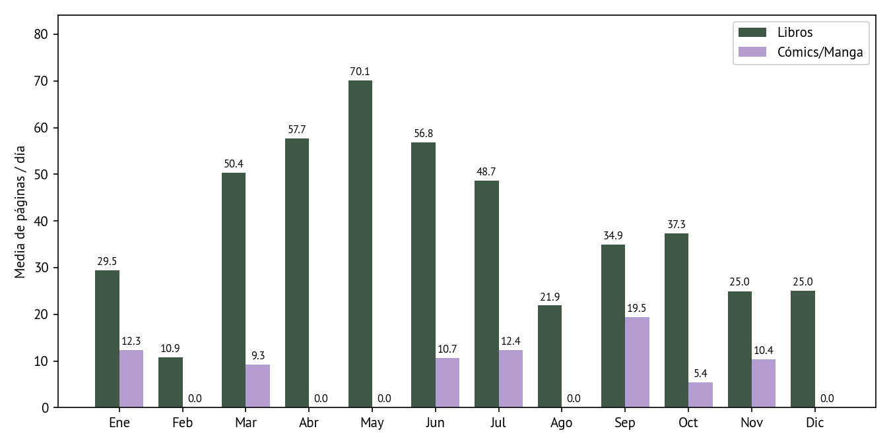

## 2021

<h3 style="margin-top:0;">Libros</h3>

Total páginas leídas

15760

Número de libros

54

<h3 style="margin-top:0;">Cómics/Manga</h3>

Total páginas leídas

1640

Número de cómics/manga

9

<h3 style="margin-top:0;">Lecturas 2021</h3>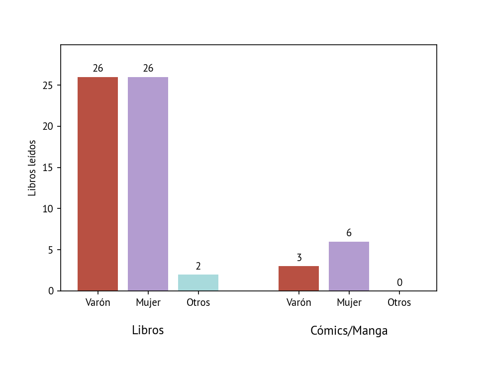

<h3 style="margin-top:0;">Libros: más corto y más largo</h3>

  
  

    
Más corto

    
72

    
páginas

  

  
  

    
Más largo

    
1152

    
páginas

  

<h3 style="margin-top:0;">Cómics/Manga: más corto y más largo</h3>

  
  

    
Más corto

    
128

    
páginas

  

  
  

    
Más largo

    
256

    
páginas

  

<h3 style="margin-top:0;">Longitud media</h3>

Libros

292

páginas de media

Cómics/Manga

182

páginas de media

<h3 style="margin-top:0;">Top 5 géneros</h3>

Libros
<ol style="margin:0;padding-left:1.2rem;"><li>Ficción (49)</li><li>Contemporaneo (21)</li><li>Ficción Literaria (19)</li><li>Novela (19)</li><li>Terror (18)</li></ol>

Cómics/Manga
<ol style="margin:0;padding-left:1.2rem;"><li>Novela gráfica (9)</li><li>Ficción (6)</li><li>LGTBIQ+ (4)</li><li>Queer (4)</li><li>Jovenes adultos (4)</li></ol>

<h3 style="margin-top:0;">Valoración</h3>
Media de nota (numérica): <strong>3.75</strong>

<h3 style="margin-top:0;">Páginas leídas por mes (Libros) — 2021</h3>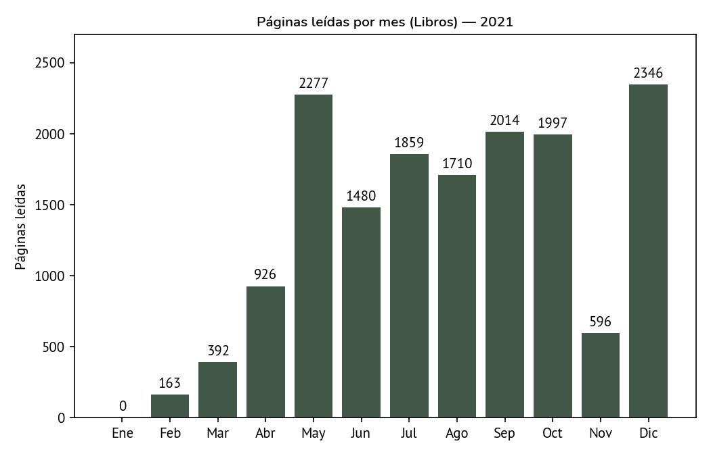

<h3 style="margin-top:0;">Páginas leídas por mes (Cómics/Manga) — 2021</h3>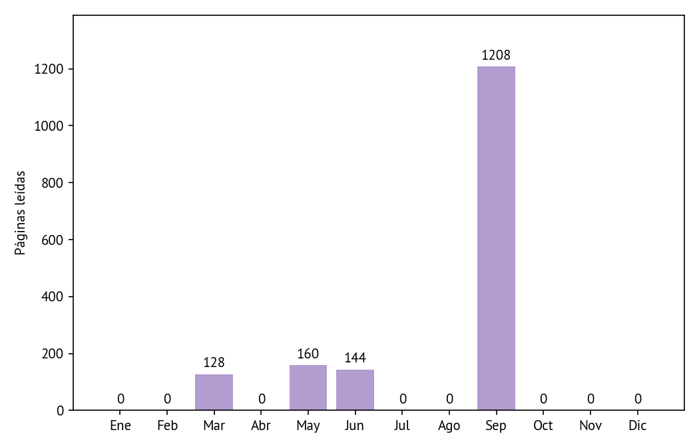

<h3 style="margin-top:0;">Media diaria de páginas leídas, por mes — 2021</h3>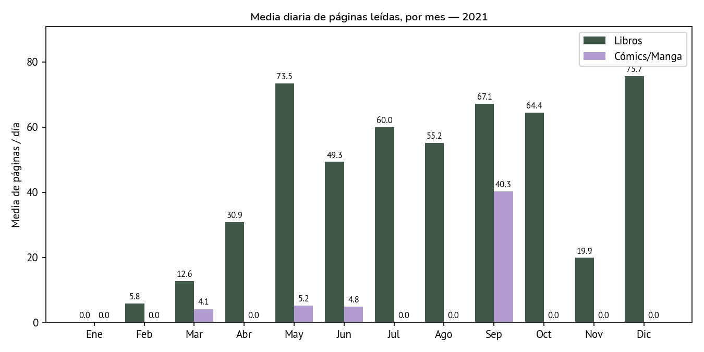

## 2020

<h3 style="margin-top:0;">Libros</h3>

Total páginas leídas

9496

Número de libros

32

<h3 style="margin-top:0;">Lecturas 2020</h3>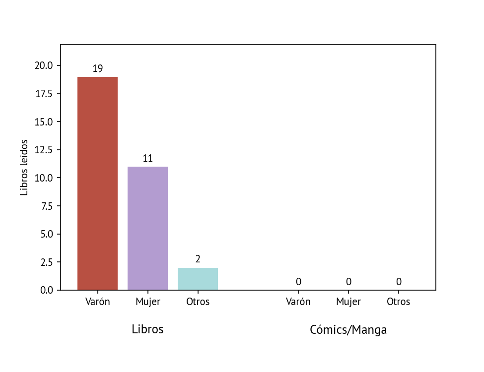

<h3 style="margin-top:0;">Libros: más corto y más largo</h3>

  
  

    
Más corto

    
80

    
páginas

  

  
  

    
Más largo

    
684

    
páginas

  

<h3 style="margin-top:0;">Longitud media</h3>

Libros

297

páginas de media

<h3 style="margin-top:0;">Top 5 géneros</h3>

Libros
<ol style="margin:0;padding-left:1.2rem;"><li>Ficción (21)</li><li>Ficción Literaria (9)</li><li>Contemporaneo (9)</li><li>Club de lectura (8)</li><li>Terror (7)</li></ol>

<h3 style="margin-top:0;">Valoración</h3>
Media de nota (numérica): <strong>3.50</strong>

<h3 style="margin-top:0;">Páginas leídas por mes (Libros) — 2020</h3>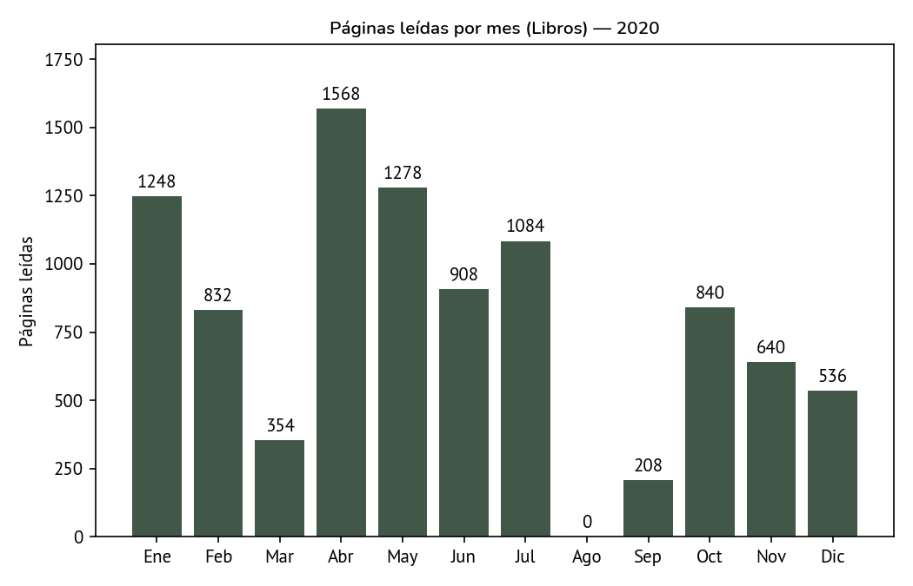

<h3 style="margin-top:0;">Media diaria de páginas leídas, por mes — 2020</h3>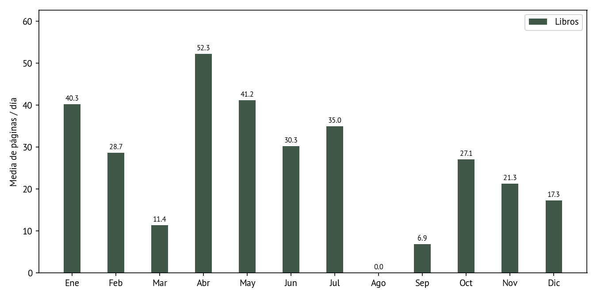

## 2019

<h3 style="margin-top:0;">Libros</h3>

Total páginas leídas

13468

Número de libros

48

<h3 style="margin-top:0;">Lecturas 2019</h3>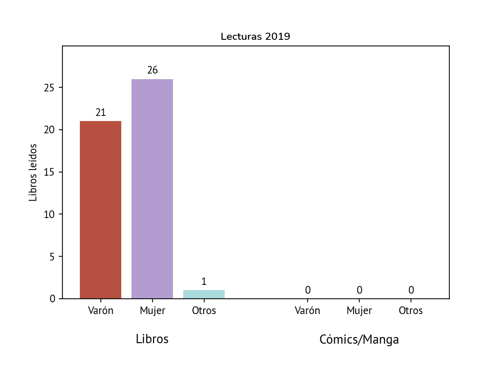

<h3 style="margin-top:0;">Libros: más corto y más largo</h3>

  
  

    
Más corto

    
66

    
páginas

  

  
  

    
Más largo

    
614

    
páginas

  

<h3 style="margin-top:0;">Longitud media</h3>

Libros

281

páginas de media

<h3 style="margin-top:0;">Top 5 géneros</h3>

Libros
<ol style="margin:0;padding-left:1.2rem;"><li>Ficción (36)</li><li>Ficción Literaria (14)</li><li>Fantasía (13)</li><li>Clásico (13)</li><li>Novela (12)</li></ol>

<h3 style="margin-top:0;">Valoración</h3>
Media de nota (numérica): <strong>3.45</strong>

<h3 style="margin-top:0;">Páginas leídas por mes (Libros) — 2019</h3>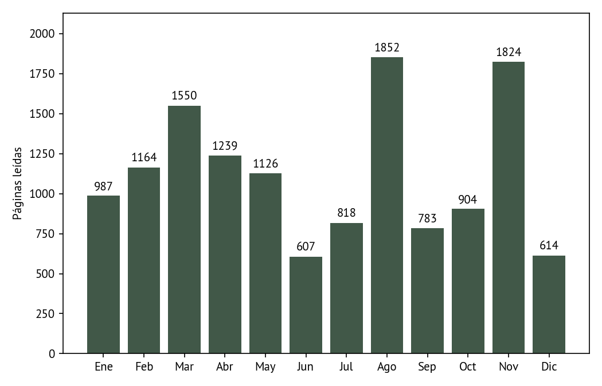

<h3 style="margin-top:0;">Media diaria de páginas leídas, por mes — 2019</h3>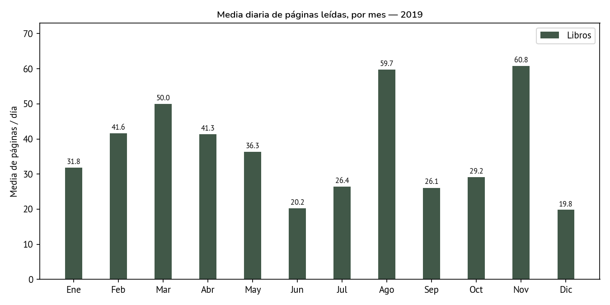

## 2018

<h3 style="margin-top:0;">Libros</h3>

Total páginas leídas

17519

Número de libros

60

<h3 style="margin-top:0;">Cómics/Manga</h3>

Total páginas leídas

960

Número de cómics/manga

26

<h3 style="margin-top:0;">Lecturas 2018</h3>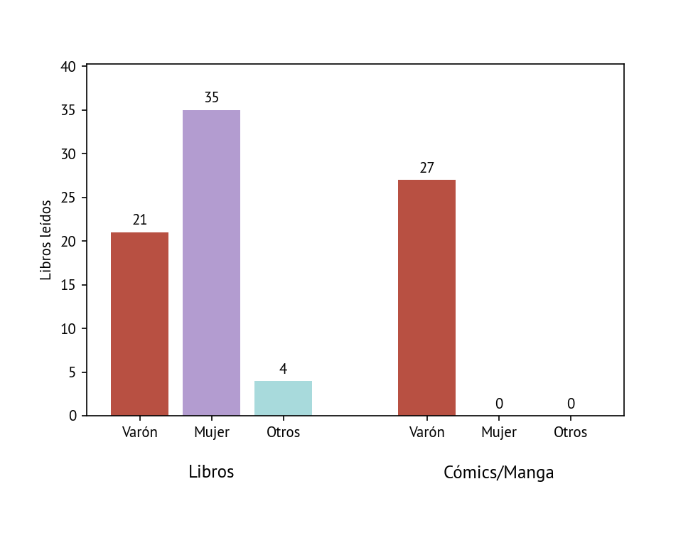

<h3 style="margin-top:0;">Libros: más corto y más largo</h3>

  
  

    
Más corto

    
9

    
páginas

  

  
  

    
Más largo

    
1008

    
páginas

  

<h3 style="margin-top:0;">Cómics/Manga: más corto y más largo</h3>

  
  

    
Más corto

    
22

    
páginas

  

  
  

    
Más largo

    
128

    
páginas

  

<h3 style="margin-top:0;">Longitud media</h3>

Libros

292

páginas de media

Cómics/Manga

37

páginas de media

<h3 style="margin-top:0;">Top 5 géneros</h3>

Libros
<ol style="margin:0;padding-left:1.2rem;"><li>Ficción (45)</li><li>Fantasía (22)</li><li>Club de lectura (20)</li><li>Contemporaneo (18)</li><li>Ciencia ficción (17)</li></ol>

Cómics/Manga
<ol style="margin:0;padding-left:1.2rem;"><li>Novela gráfica (27)</li><li>Fantasía (26)</li><li>Ficción (11)</li><li>Humor (10)</li><li>Comedia (6)</li></ol>

<h3 style="margin-top:0;">Valoración</h3>
Media de nota (numérica): <strong>3.45</strong>

<h3 style="margin-top:0;">Páginas leídas por mes (Libros) — 2018</h3>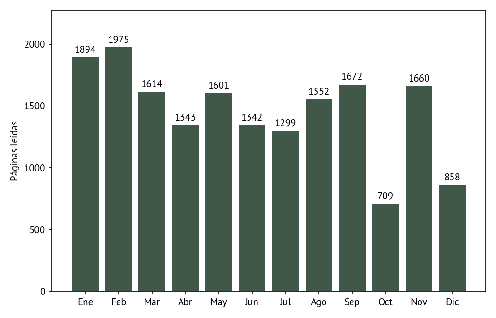

<h3 style="margin-top:0;">Páginas leídas por mes (Cómics/Manga) — 2018</h3>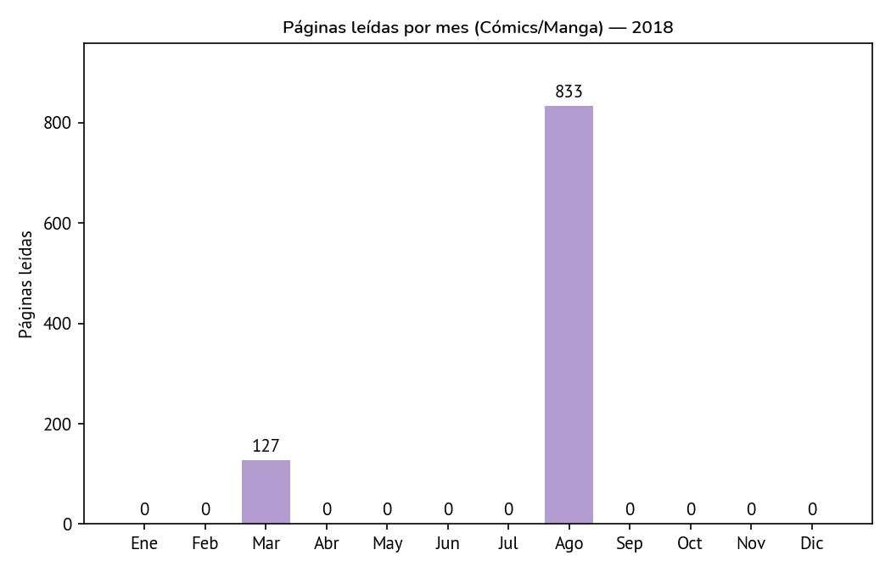

<h3 style="margin-top:0;">Media diaria de páginas leídas, por mes — 2018</h3>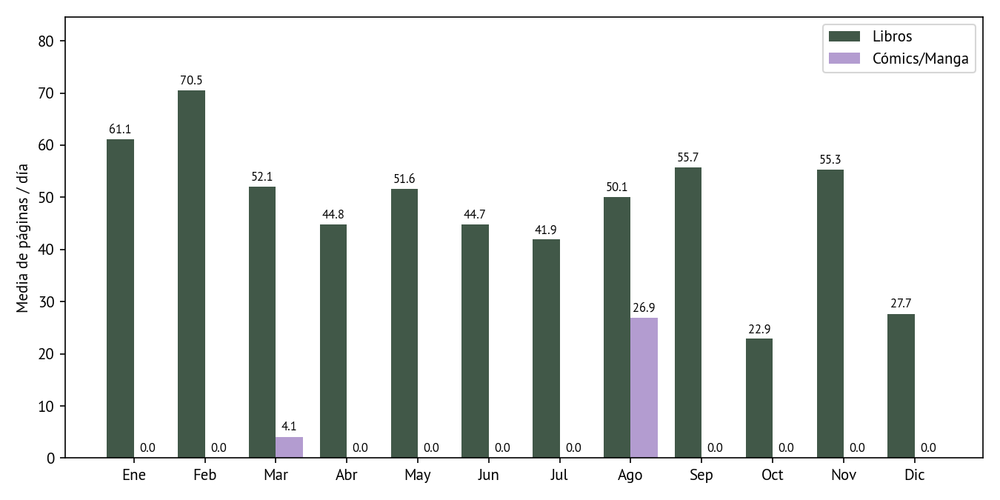

## 2017

<h3 style="margin-top:0;">Libros</h3>

Total páginas leídas

14953

Número de libros

55

<h3 style="margin-top:0;">Cómics/Manga</h3>

Total páginas leídas

665

Número de cómics/manga

3

<h3 style="margin-top:0;">Lecturas 2017</h3>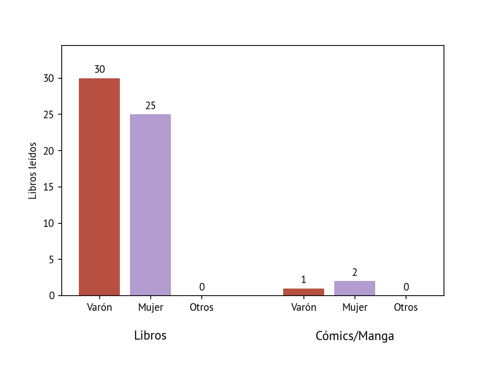

<h3 style="margin-top:0;">Libros: más corto y más largo</h3>

  
  

    
Más corto

    
32

    
páginas

  

  
  

    
Más largo

    
840

    
páginas

  

<h3 style="margin-top:0;">Cómics/Manga: más corto y más largo</h3>

  
  

    
Más corto

    
161

    
páginas

  

  
  

    
Más largo

    
324

    
páginas

  

<h3 style="margin-top:0;">Longitud media</h3>

Libros

272

páginas de media

Cómics/Manga

222

páginas de media

<h3 style="margin-top:0;">Top 5 géneros</h3>

Libros
<ol style="margin:0;padding-left:1.2rem;"><li>Ficción (38)</li><li>Fantasía (20)</li><li>Club de lectura (19)</li><li>Ciencia ficción (17)</li><li>Adultos (16)</li></ol>

Cómics/Manga
<ol style="margin:0;padding-left:1.2rem;"><li>Novela gráfica (3)</li><li>Ficción (3)</li><li>Romance (2)</li><li>Jovenes adultos (2)</li><li>Ciencia ficción (1)</li></ol>

<h3 style="margin-top:0;">Valoración</h3>
Media de nota (numérica): <strong>3.70</strong>

<h3 style="margin-top:0;">Páginas leídas por mes (Libros) — 2017</h3>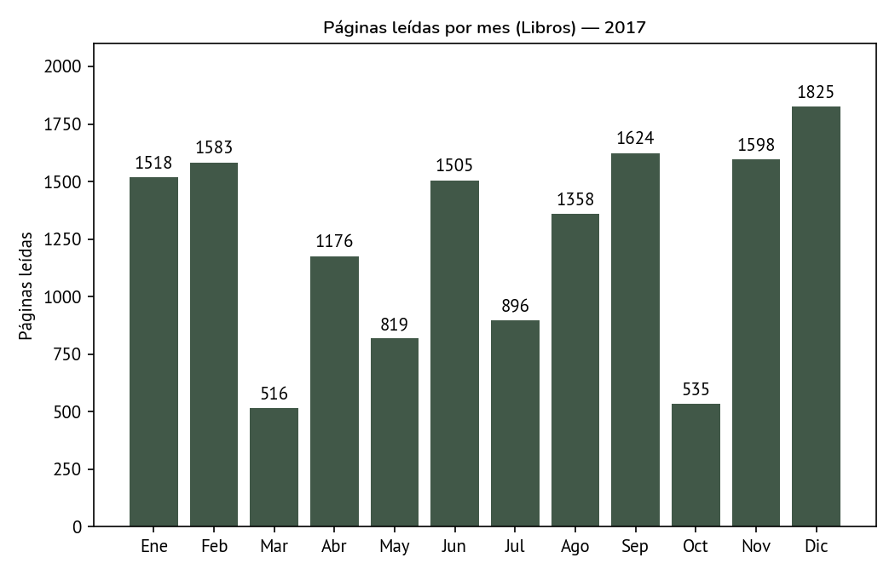

<h3 style="margin-top:0;">Páginas leídas por mes (Cómics/Manga) — 2017</h3>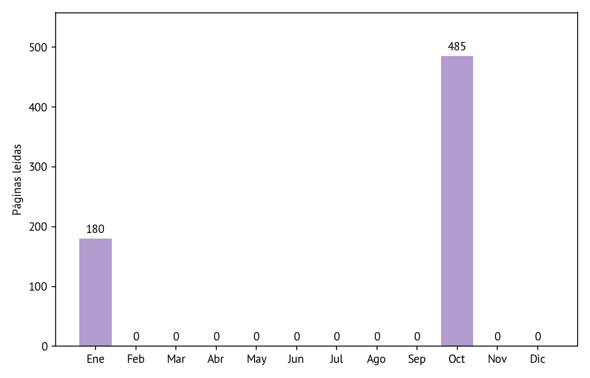

<h3 style="margin-top:0;">Media diaria de páginas leídas, por mes — 2017</h3>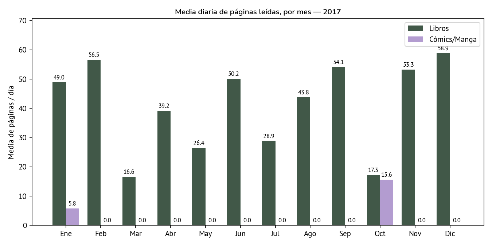

## 2016

<h3 style="margin-top:0;">Libros</h3>

Total páginas leídas

23109

Número de libros

61

<h3 style="margin-top:0;">Cómics/Manga</h3>

Total páginas leídas

288

Número de cómics/manga

1

<h3 style="margin-top:0;">Lecturas 2016</h3>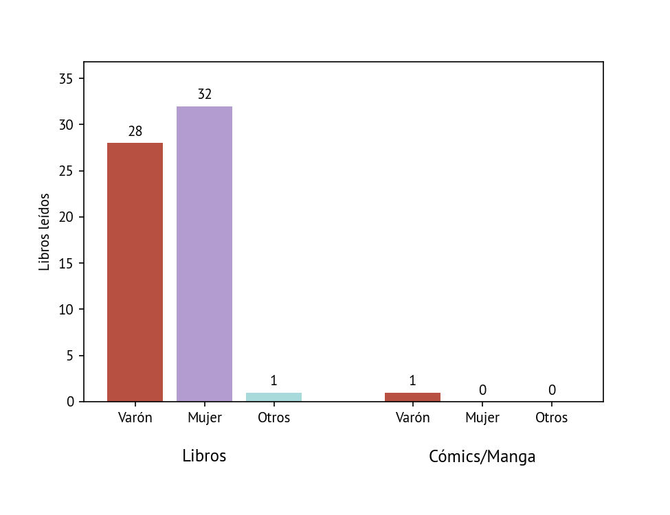

<h3 style="margin-top:0;">Libros: más corto y más largo</h3>

  
  

    
Más corto

    
73

    
páginas

  

  
  

    
Más largo

    
1007

    
páginas

  

<h3 style="margin-top:0;">Cómics/Manga: más corto y más largo</h3>

  
  

    
Más corto

    
288

    
páginas

  

  
  

    
Más largo

    
288

    
páginas

  

<h3 style="margin-top:0;">Longitud media</h3>

Libros

379

páginas de media

Cómics/Manga

288

páginas de media

<h3 style="margin-top:0;">Top 5 géneros</h3>

Libros
<ol style="margin:0;padding-left:1.2rem;"><li>Ficción (49)</li><li>Fantasía (21)</li><li>Clásico (20)</li><li>Novela (18)</li><li>Club de lectura (15)</li></ol>

Cómics/Manga
<ol style="margin:0;padding-left:1.2rem;"><li>LGTBIQ+ (1)</li></ol>

<h3 style="margin-top:0;">Valoración</h3>
Media de nota (numérica): <strong>3.45</strong>

<h3 style="margin-top:0;">Páginas leídas por mes (Libros) — 2016</h3>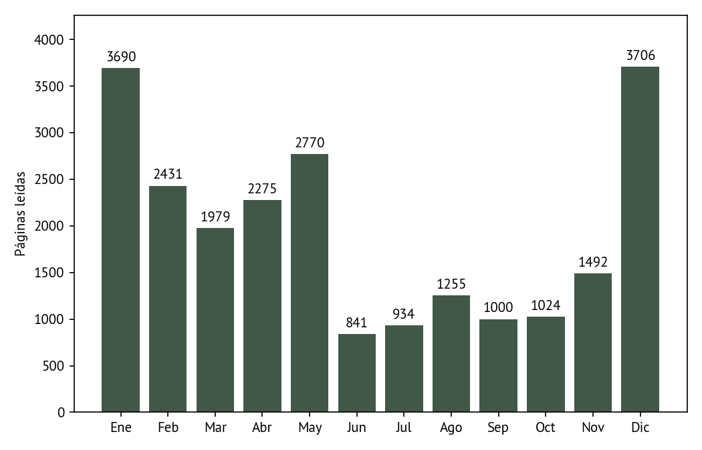

<h3 style="margin-top:0;">Páginas leídas por mes (Cómics/Manga) — 2016</h3>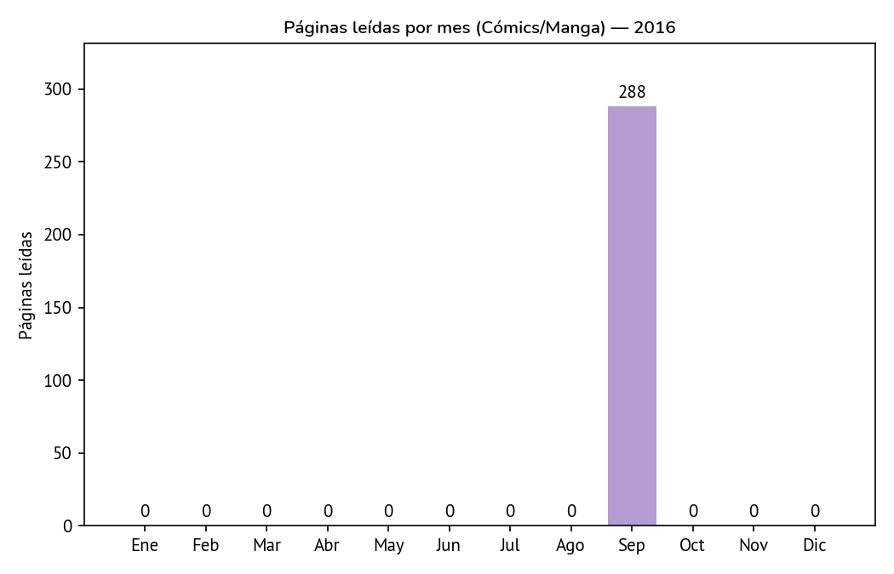

<h3 style="margin-top:0;">Media diaria de páginas leídas, por mes — 2016</h3>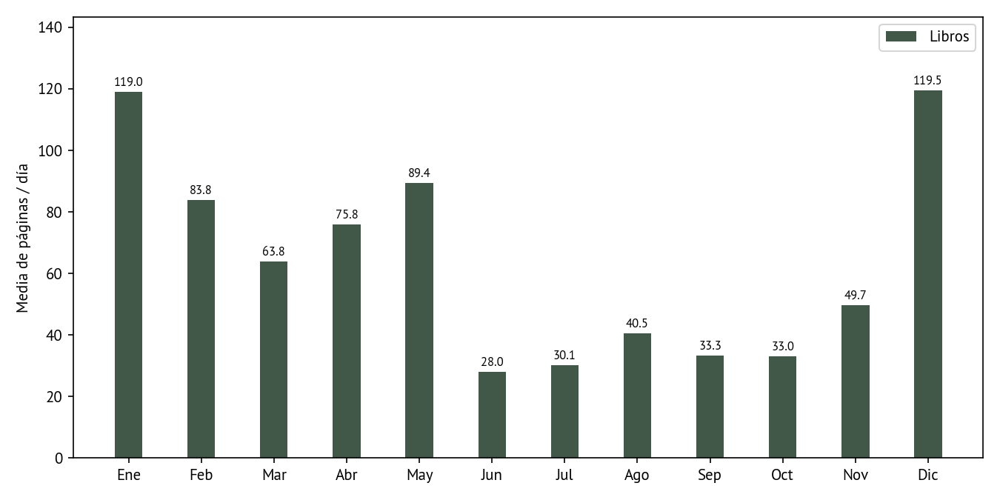

## 2015

<h3 style="margin-top:0;">Libros</h3>

Total páginas leídas

24122

Número de libros

79

<h3 style="margin-top:0;">Lecturas 2015</h3>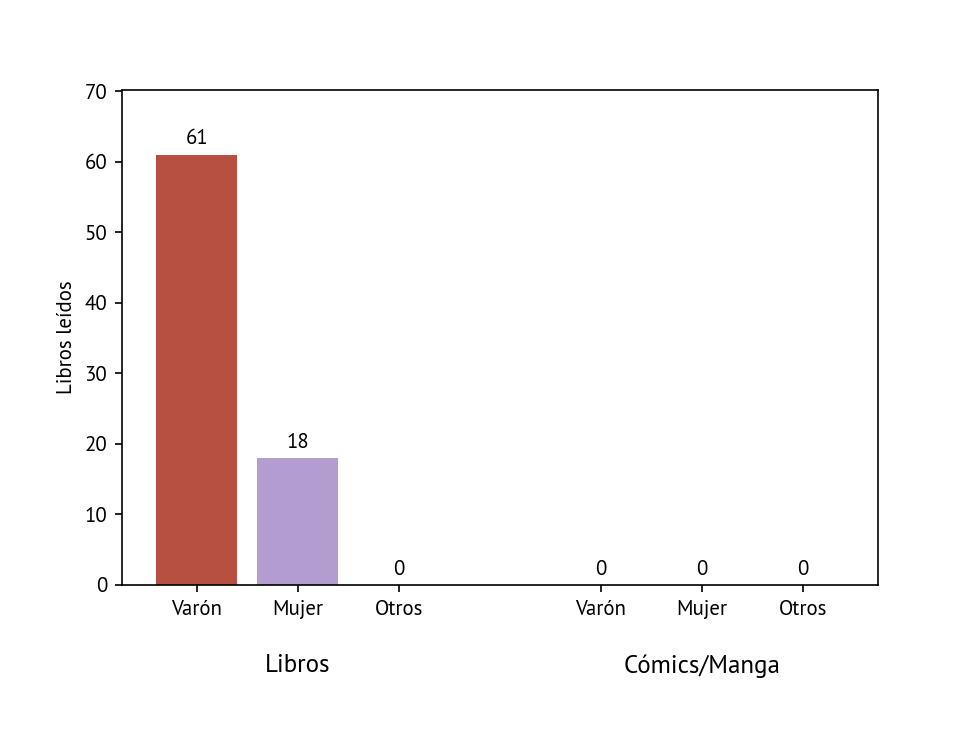

<h3 style="margin-top:0;">Libros: más corto y más largo</h3>

  
  

    
Más corto

    
46

    
páginas

  

  
  

    
Más largo

    
808

    
páginas

  

<h3 style="margin-top:0;">Longitud media</h3>

Libros

305

páginas de media

<h3 style="margin-top:0;">Top 5 géneros</h3>

Libros
<ol style="margin:0;padding-left:1.2rem;"><li>Ficción (62)</li><li>Novela (32)</li><li>Contemporaneo (25)</li><li>Literatura (22)</li><li>Clásico (21)</li></ol>

<h3 style="margin-top:0;">Valoración</h3>
Media de nota (numérica): <strong>3.53</strong>

<h3 style="margin-top:0;">Páginas leídas por mes (Libros) — 2015</h3>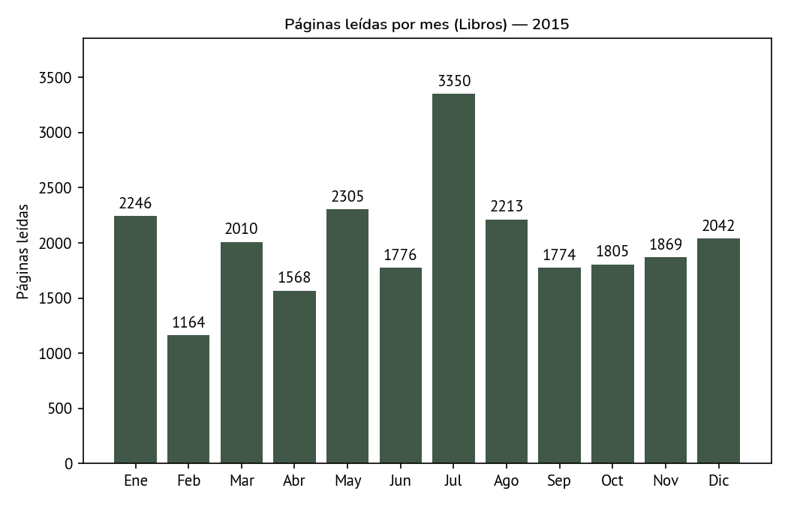

<h3 style="margin-top:0;">Media diaria de páginas leídas, por mes — 2015</h3>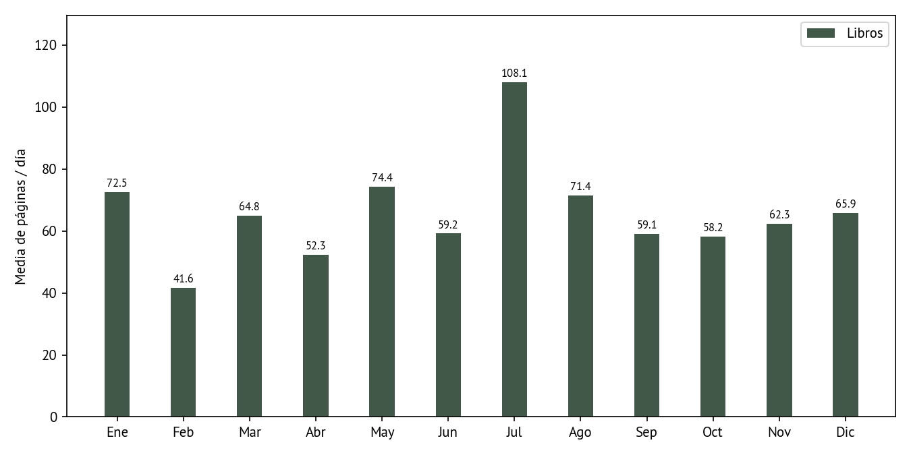

## 2014

<h3 style="margin-top:0;">Libros</h3>

Total páginas leídas

25131

Número de libros

82

<h3 style="margin-top:0;">Cómics/Manga</h3>

Total páginas leídas

1200

Número de cómics/manga

1

<h3 style="margin-top:0;">Lecturas 2014</h3>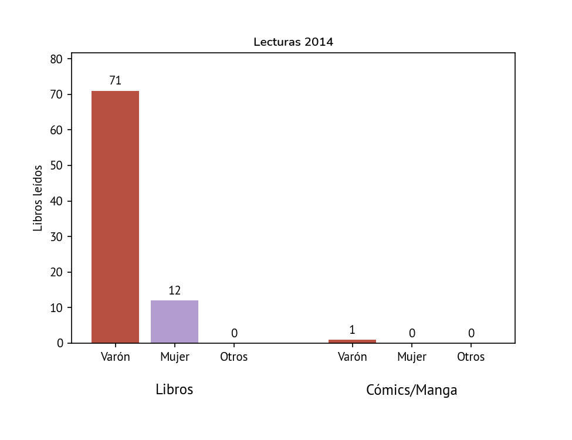

<h3 style="margin-top:0;">Libros: más corto y más largo</h3>

  
  

    
Más corto

    
110

    
páginas

  

  
  

    
Más largo

    
912

    
páginas

  

<h3 style="margin-top:0;">Cómics/Manga: más corto y más largo</h3>

  
  

    
Más corto

    
1200

    
páginas

  

  
  

    
Más largo

    
1200

    
páginas

  

<h3 style="margin-top:0;">Longitud media</h3>

Libros

306

páginas de media

Cómics/Manga

1200

páginas de media

<h3 style="margin-top:0;">Top 5 géneros</h3>

Libros
<ol style="margin:0;padding-left:1.2rem;"><li>Ficción (63)</li><li>Clásico (35)</li><li>Literatura (31)</li><li>Novela (30)</li><li>Club de lectura (26)</li></ol>

Cómics/Manga
<ol style="margin:0;padding-left:1.2rem;"><li>Novela gráfica (1)</li></ol>

<h3 style="margin-top:0;">Valoración</h3>
Media de nota (numérica): <strong>3.81</strong>

<h3 style="margin-top:0;">Páginas leídas por mes (Libros) — 2014</h3>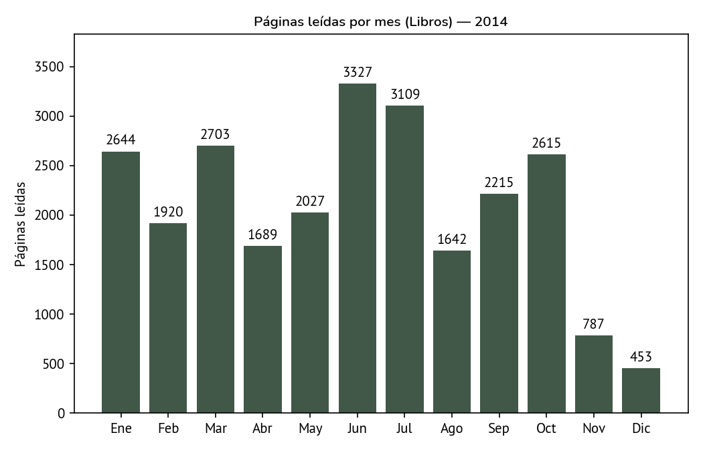

<h3 style="margin-top:0;">Páginas leídas por mes (Cómics/Manga) — 2014</h3>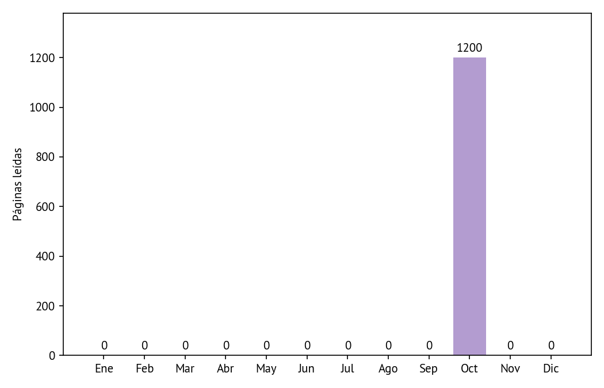

<h3 style="margin-top:0;">Media diaria de páginas leídas, por mes — 2014</h3>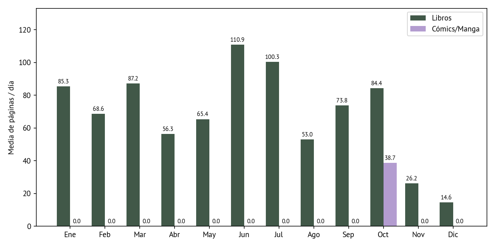

